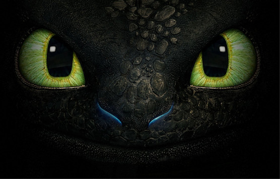

<h1 align="center"> Toothless</h1>

     [Image Credits:Youtube]

  

<h2 align="centre"> Classifying Radio Galaxies with Convolutional Neural Network </h2>

 <b> Arun Aniyan and Kshitij Thorat   SKA South Africa & Rhodes University   arun@ska.ac.za </b>

This is repository contains the Code and Model to do the morphological classification of radio galaxies with deep convolutional neural network. 

The model is implemented with the popular deep learning package [Caffe](http://caffe.berkeleyvision.org/). 

Before you run the code the following software requirements need to met :

- Python 2.7.x
- [Caffe](http://caffe.berkeleyvision.org/)
- [PIL](https://pillow.readthedocs.io/en/4.1.x/)
- [Astropy](http://www.astropy.org/)
- [Photoutils](https://photutils.readthedocs.io/en/stable/)
- [Scikit-image](http://scikit-image.org/)

The repository contains the following folders required for executing the code
- Models - Contains the trained caffe models
- Prototxt - Contains the network structure for deployment
- Labels - Contains the labels 
- Sample-Images - Contains image to test the model
